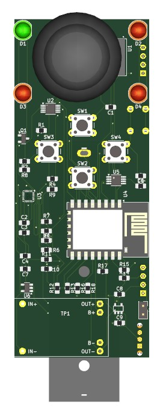
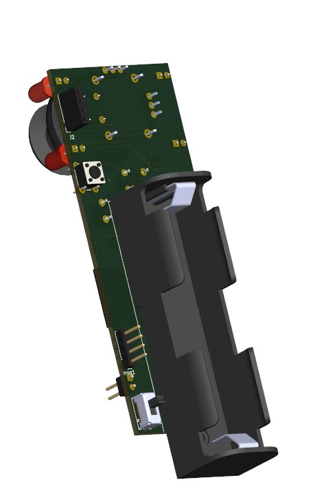
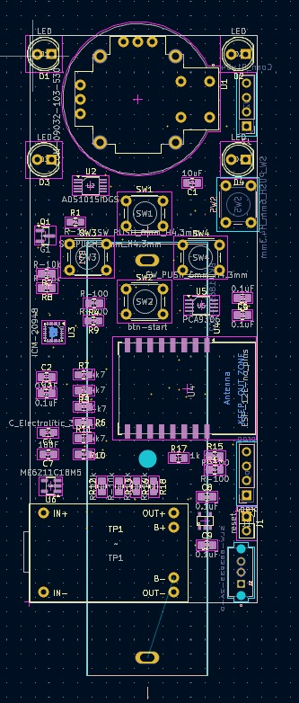

# VR-Driver Project

A custom VR controller driver for SteamVR that receives UDP data from external controllers (Arduino-based or mobile devices) and translates it into VR controller input.

## Quick Start

### Prerequisites

1. **Install ALVR** - Download from [ALVR GitHub Releases](https://github.com/alvr-org/ALVR/releases)
2. **Install PhoneVR** - Use ALVR-compatible version from [PhoneVR](https://phonevr.app/)
3. **SteamVR** - Install via Steam

### Installation

## YOU HAVE DIFFERENT OPTIONS HOW TO RUN THIS USING DEVICES WHICH YOU HAVE
1. Using you own webcamera
2. Using your Android phone


#### Option 1: Use Pre-built Release (Recommended)
1. Download the latest release from [Releases](../../releases)
2. Extract files to a temporary folder
3. Run `manual_install.bat` as Administrator
4. Follow the testing steps below

#### Option 2: Manual Installation
1. Copy driver files to SteamVR drivers folder:
   ```
   C:\Program Files (x86)\Steam\steamapps\common\SteamVR\drivers\cvdriver\
   ```
2. Create folder structure:
   ```
   cvdriver/
   ├── bin/win64/
   │   ├── driver_cvdriver.dll
   │   └── openvr_api.dll
   └── resources/
       ├── driver.vrdrivermanifest
       └── input/
           └── cvcontroller_profile.json
   ```
3. Register driver in `openvrpaths.vrpath`:
   ```
   C:\Users\<YourName>\AppData\Local\openvr\openvrpaths.vrpath
   ```
   Add:
   ```json
   {
     "external_drivers": [
       "C:\\Program Files (x86)\\Steam\\steamapps\\common\\SteamVR\\drivers\\cvdriver"
     ]
   }
   ```

### Testing the Installation

1. **Test UDP Communication:**
   ```bash
   cd steamVR-controller-driver-C
   python simple_simulator.py
   ```

2. **Start SteamVR** and check for 2 controllers (CV_Controller_Left, CV_Controller_Right)

3. **Verify in SteamVR Status** → Devices → Manage Controllers

## Hardware Setup

### PCB Design
The project includes a custom PCB design for the VR controller hardware.





### Ordering PCB
1. **PCB Manufacturer:** [PCBWay](https://www.pcbway.com/)
2. **Gerber Files:** Located in `kicad/gerber/gerber.zip`
3. **Assembly Guide:** See `kicad/smd-placement.pdf`
4. **Print Dimensions:** See `kicad/print_scheme_sizes.pdf`

## ArUco Marker Generation

The project uses ArUco markers for visual tracking. Generate markers using:

```bash
cd Android_ArCode/python-test
pip install -r requirements.txt
python generate_aruco.py
```

This creates markers `aruco_marker_0.png` through `aruco_marker_9.png`.

### ArUco Code Reference
- **Print Template:** `kicad/scheme-print-arUco-code.pdf`
- **Dictionary:** DICT_6X6_250
- **Marker Size:** 300x300 pixels with 20px border

## How It Works

The VR driver operates as a UDP server that:

1. **Listens** for UDP packets on port 5555 (configurable)
2. **Receives** controller data including:
   - Quaternion orientation (w, x, y, z)
   - Accelerometer data (x, y, z)
   - Gyroscope data (x, y, z)
   - Button states (16-bit mask)
   - Trigger values (0-255)
3. **Translates** this data into SteamVR controller input
4. **Updates** controller positions and states in real-time

### Data Packet Format
```c
struct ControllerData {
    uint8_t controller_id;    // 0 = left, 1 = right
    uint32_t packet_number;   // Sequence number
    float quat[4];           // Orientation (w,x,y,z)
    float accel[3];          // Acceleration (x,y,z)
    float gyro[3];           // Angular velocity (x,y,z)
    uint16_t buttons;        // Button bitmask
    uint8_t trigger;         // Trigger value 0-255
    uint8_t checksum;        // Data integrity check
};
```

## Python Testing Scripts

### Controller Simulator
```bash
python steamVR-controller-driver-C/simple_simulator.py
```
Simulates 2 VR controllers with rotating motion and button presses.

### UDP Test Server
```bash
python Android_ArCode/python-test/test_server.py
```
Receives and displays UDP packets for debugging.

## Android ArUco Tracking

The `Android_ArCode` folder contains an Android application that:
- Uses camera to detect ArUco markers
- Calculates controller position/orientation
- Sends UDP data to the VR driver

### Building Android App
```bash
cd Android_ArCode
./gradlew assembleDebug
```

## Project Documentation

### Technical References
- **PCB Assembly:** `kicad/smd-placement.pdf`
- **ArUco Printing:** `kicad/scheme-print-arUco-code.pdf`
- **Board Dimensions:** `kicad/print_scheme_sizes.pdf`

### Driver Documentation
- **Setup Guide:** `steamVR-controller-driver-C/README.md`
- **Testing Guide:** `steamVR-controller-driver-C/TESTING_GUIDE.md`
- **Step-by-Step:** `steamVR-controller-driver-C/STEP_BY_STEP_TESTING.md`

## Troubleshooting

### Controllers Not Appearing
1. Check SteamVR logs: `C:\Program Files (x86)\Steam\logs\vrserver.txt`
2. Verify driver registration in `openvrpaths.vrpath`
3. Ensure UDP port 5555 is not blocked by firewall

### No UDP Data Received
1. Test with `simple_simulator.py`
2. Check firewall settings
3. Verify IP address and port configuration

### Build Issues
1. Ensure OpenVR SDK is properly installed
2. Check CMake configuration
3. Verify Visual Studio 2022 is installed

## Links and Resources

- **ALVR:** [GitHub](https://github.com/alvr-org/ALVR) | [Releases](https://github.com/alvr-org/ALVR/releases)
- **PhoneVR:** [Official Site](https://phonevr.app/)
- **PCBWay:** [PCB Manufacturing](https://www.pcbway.com/)
- **OpenVR:** [Valve OpenVR SDK](https://github.com/ValveSoftware/openvr)
- **SteamVR:** [Steam Store](https://store.steampowered.com/app/250820/SteamVR/)

## Project Structure

```
VR-Driver/
├── Android_ArCode/              # Android ArUco tracking app
│   └── python-test/            # Python test scripts
├── kicad/                      # PCB design files
│   ├── gerber/                # Manufacturing files
│   └── images/                # PCB photos
├── steamVR-controller-driver-C/ # Main VR driver
│   ├── src/                   # Driver source code
│   ├── resources/             # Driver manifest and profiles
│   └── manual_install.bat     # Installation script
└── README.md                  # This file
```

## License

This project is open source. Check individual component licenses for specific terms.